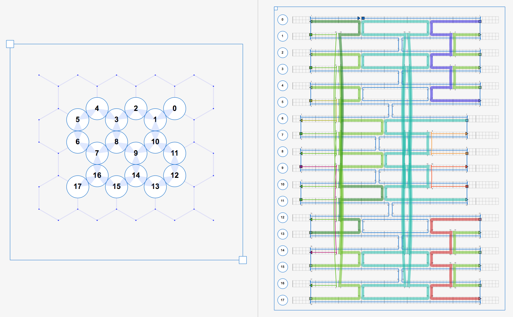

.. cadnano scripting

Scripting
=========

Cadnano2.5 can be invoked from a Python3 script. Manipulating the cadnano
data model without invoking the GUI window can be useful for automating
certain tasks that are tedious with the mouse and keyboard. After importing the
cadnano package with ``import cadnano`` and initializing a Document, it is
straightforward to make API calls via object references to the document, part,
oligos, strands, and so on.

.. note::
   The code block line numbers do not line up due to a bug (`#415`_) with the readthedocs
   theme. It is fixed in the beta (0.2.5b2) but may not be reflected here yet.

.. _`#415`: https://github.com/rtfd/sphinx_rtd_theme/issues/415

Basic concepts
--------------

Here is a simple example, which can be found in `misc/examples`_ along with
other scripts. It reads an input file and prints some information.

.. _misc/examples: https://github.com/cadnano/cadnano2.5/tree/master/misc/examples

.. literalinclude:: _static/bare_bones_example.py
   :linenos:

Let's go line-by-line:

.. literalinclude:: _static/bare_bones_example.py
   :lines: 1
   :lineno-start: 1
   :linenos:

Make sure you are using the python3 interpreter, not python2.

.. literalinclude:: _static/bare_bones_example.py
   :lines: 6-7
   :lineno-start: 6
   :linenos:

The cadnano package must be imported to make use of its functions. If the import
fails with the python3 interpreter, try calling ``pip3 list`` from the terminal
and check that cadnano and PyQt5 are both installed. If PyQt5 is installed, you
should also be able to cleanly ``import PyQt5`` without any exception. The
submodule document contains the class Document, which we will use as well.

.. literalinclude:: _static/bare_bones_example.py
   :lines: 9
   :lineno-start: 9
   :linenos:

Here we create a cadnano application object, and store a reference. See
`cadnano.app`_ and `cadnano.__init__.py`_ in the source.

.. _`cadnano.app`: api/cadnano.rst#cadnano.app
.. _`cadnano.__init__.py`: https://github.com/cadnano/cadnano2.5/blob/master/cadnano/__init__.py

.. literalinclude:: _static/bare_bones_example.py
   :lines: 10-11
   :lineno-start: 10
   :linenos:

Create a new Document instance, assign it to the ``app.document``
variable, as well as ``doc`` variable in the local scope. The
`Document`_ class is the root of the model. It is the parent of all
parts and maintains the undo stack.

.. _`Document`: api/cadnano.document.html

.. literalinclude:: _static/bare_bones_example.py
   :lines: 12
   :lineno-start: 12
   :linenos:

The `Part`_ class corresponds to a molecular nanostructure. 
`NucleicAcidPart`_ subclasses Part, and corresponds to a DNA origami design.
At the lowest level, origami designs are comprised of `Strand`_ objects, 
which are contiguous segments of ssDNA between endpoints and/or crossovers.
Parts keep track of Strands in two separate classes simultaneously: 
`Oligo`_ and `VirtualHelix`_.

.. _`Part`: api/cadnano.part.part.html
.. _`NucleicAcidPart`: api/cadnano.part.nucleicacidpart.html
.. _`Strand`: api/cadnano.strand.strand.html
.. _`Oligo`: api/cadnano.oligo.oligo.html
.. _`VirtualHelix`: api/cadnano.part.virtualhelix.html

We can finally start doing useful maniupulations at the oligo level. 
Before we examine the output, let's take a look at the input file in the GUI.

Oligos correspond to a full-length physical oligonucleotide (i.e. a "staple"
or "scaffold"). 

.. literalinclude:: _static/bare_bones_example.py
   :emphasize-lines: 14-19
   :linenos:

We can iterate over the Part's oligos and print their repr,
length, color, and sequence (which should be none since we haven't
applied anything yet.) Now let's look at the output of lines 15–19. 

::

    <Oligo 3688>(10[53])   24   '#f74308'   None
    <Oligo 1064>(7[2])     21   '#57bb00'   None
    <Oligo 6560>(17[5])    74   '#57bb00'   None
    <Oligo 5224>(14[57])   18   '#57bb00'   None
    <Oligo 1344>(6[53])   276   '#03b6a2'   None
    <Oligo 1416>(13[5])    74   '#007200'   None
    <Oligo 7064>(5[21])    42   '#0066cc'   None
    <Oligo 1928>(8[53])    24   '#f7931e'   None
    <Oligo 1368>(11[2])    21   '#57bb00'   None
    <Oligo 1544>(4[57])    18   '#57bb00'   None
    <Oligo 6928>(15[5])    74   '#57bb00'   None
    <Oligo 7648>(2[57])    18   '#57bb00'   None
    <Oligo 8720>(5[5])     21   '#aaaa00'   None
    <Oligo 3216>(0[57])    60   '#1700de'   None
    <Oligo 3360>(1[5])     21   '#57bb00'   None
    <Oligo 3176>(16[57])   18   '#57bb00'   None
    <Oligo 5672>(0[21])   948   '#0066cc'   None
    <Oligo 4304>(13[21])   42   '#0066cc'   None
    <Oligo 3416>(9[2])     21   '#b8056c'   None
    <Oligo 4808>(12[57])   60   '#cc0000'   None
    <Oligo 9808>(3[5])     21   '#57bb00'   None

The VirtualHelix (VH) is a group of Strands that share the same
double-helix axis in space. VHs each contain a “forward” and “reverse”
`StrandSet`_, which is a container class for a group of Strands along
the same helix axis.

.. _StrandSet: api/cadnano.strand.strand.html

.. literalinclude:: _static/bare_bones_example.py
   :lines: 21-28
   :lineno-start: 21
   :linenos:

Here we use ``Part.getStrandSets()`` to get references to both the fwd and rev
StrandSets, and use list concatenations to print the start and end indices via ``Strand.idxs()``,
and color via ``Strand.getColor()``.

.. image:: _static/myfile_vh012.png
   

::

    VH0
       <fwd_StrandSet(0)>    [(5, 20), (21, 57)] 
                             ['#0066cc', '#0066cc']
       <rev_StrandSet(0)>    [(5, 20), (21, 41), (42, 57)] 
                             ['#007200', '#03b6a2', '#1700de']
    VH1
       <fwd_StrandSet(1)>    [(5, 13), (14, 20), (21, 34), (35, 41), (42, 48), (49, 57)] 
                             ['#57bb00', '#007200', '#03b6a2', '#03b6a2', '#1700de', '#57bb00']
       <rev_StrandSet(1)>    [(5, 32), (33, 57)] 
                             ['#0066cc', '#0066cc']
    VH2
       <fwd_StrandSet(2)>    [(5, 32), (33, 57)] 
                             ['#0066cc', '#0066cc']
       <rev_StrandSet(2)>    [(5, 20), (21, 41), (42, 48), (49, 57)] 
                             ['#57bb00', '#03b6a2', '#1700de', '#57bb00']

Apply scaffold sequence
-----------------------

TK

Break a strand
--------------

`TK`_

.. _`TK`: https://en.wikipedia.org/wiki/To_come_(publishing)

Modify oligo sequences by color
-------------------------------

TK

Export to legacy format
-----------------------

TK